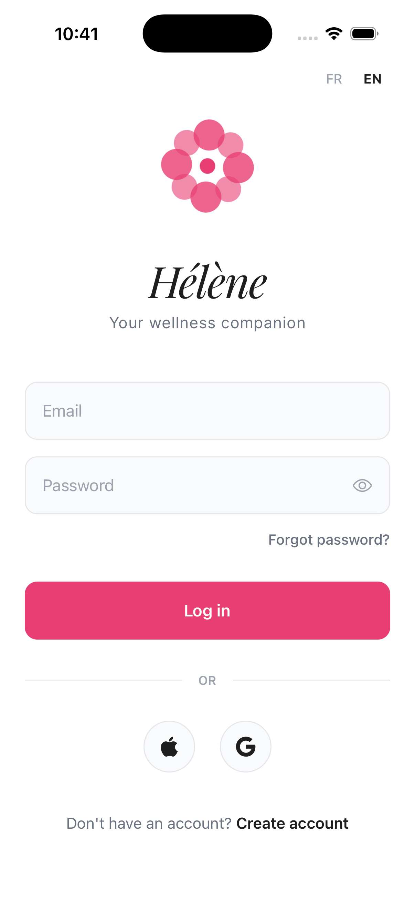
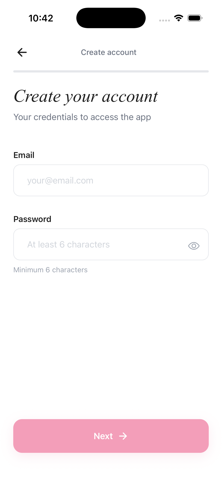
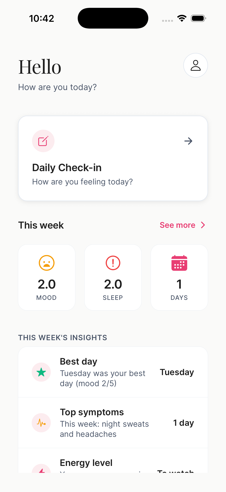
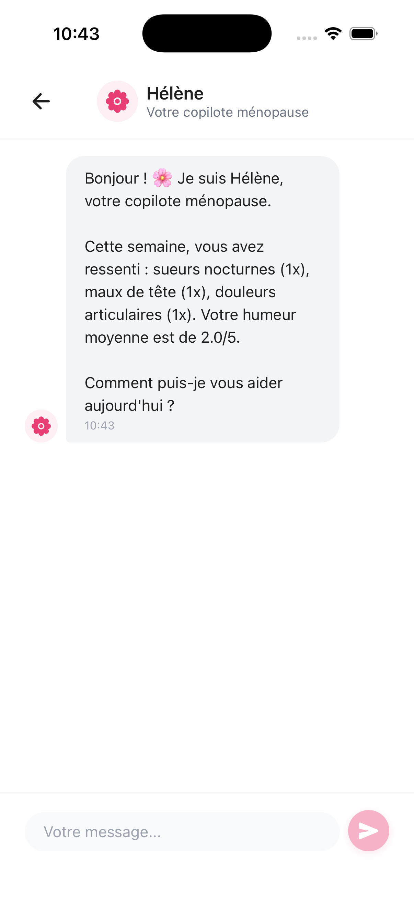
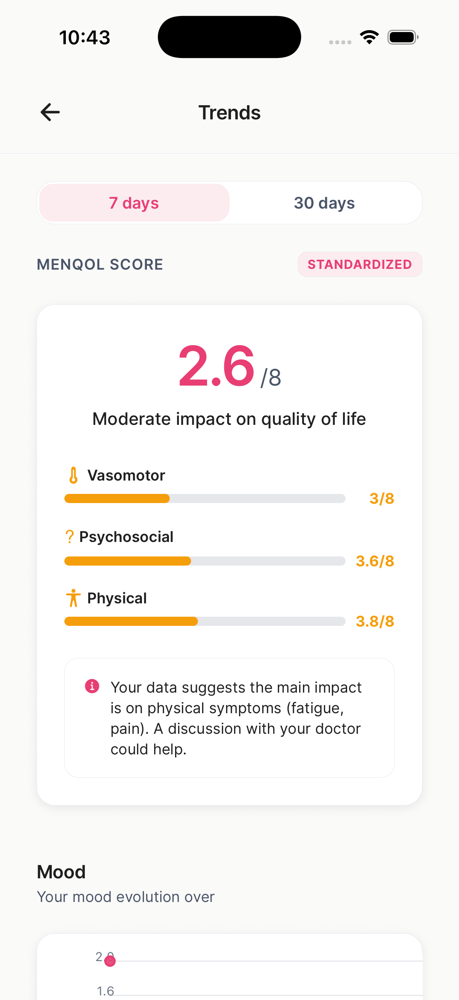

# Hélène — Women’s Health Companion (Perimenopause & Menopause)

<p align="center">
  
  
  
</p>
<p align="center">
  
  
  
</p>

Hélène is a mobile app designed to support women through perimenopause and menopause.
It turns daily check-ins into clear trends, practical insights, and a calmer, more informed experience—without adding friction or noise.

## The problem
Symptoms during this transition can be wide-ranging (sleep, mood, energy, hot flashes, anxiety, brain fog…), fluctuate daily, and are hard to summarize for yourself—or for a clinician.
Most tools either feel too clinical, too generic, or don’t connect the dots over time.

## How Hélène helps
- **Fast daily check-in**: mood, energy, sleep, symptoms, and optional notes.
- **Trends that make sense**: charts and summaries over the last weeks.
- **Emotional journal**: note history + sentiment trends for your written reflections.
- **Personalization**: menopause stage + goals, used to tailor the experience.
- **Medical PDF export**: a concise report you can share with your clinician.
- **Reminders**: optional daily notifications.
- **AI companion (optional)**: empathetic guidance and education (demo mode supported).

## Technical implementation
- **App**: React Native (Expo)
- **Backend**: Supabase (Auth + Postgres)
- **Analytics**: computed trends + sentiment analysis from check-in history
- **Charts**: `react-native-chart-kit`
- **Reports**: `expo-print` + `expo-sharing`
- **Notifications**: `expo-notifications`
- **AI**: Gemini API (can be disabled / demo mode)
- **i18n**: English + French

## Run locally
```bash
npm install
npm start
```

Then launch on a device/simulator:
```bash
npm run ios
# or
npm run android
```

## Configure Supabase & AI
Create a `.env` file (never commit it) based on `.env.example`.

Required:
- `EXPO_PUBLIC_SUPABASE_URL`
- `EXPO_PUBLIC_SUPABASE_ANON_KEY`

Optional (only if you disable demo mode):
- `EXPO_PUBLIC_GEMINI_API_KEY`
- `EXPO_PUBLIC_GEMINI_MODEL`

Runtime config is injected via `app.config.js` and read in:
- `src/lib/supabase.js`
- `src/lib/gemini.js`

## Database (Supabase)
SQL scripts are included to bootstrap and evolve the schema:
- `supabase/schema-v2.sql`
- `supabase/trigger-v2.sql`
- `supabase/daily-logs.sql`
- `supabase/sentiment-migration.sql`
- `supabase/treatment-migration.sql`

## Project structure
```
.
├── App.js
├── src/
│   ├── screens/          # App screens (Home, Check-in, Trends, Journal, Profile...)
│   ├── lib/              # Supabase + AI clients
│   ├── utils/            # Insights, sentiment, notifications, PDF generation
│   ├── i18n/             # Translations
│   └── constants/        # Theme tokens
└── screenshot/           # App screenshots used in this README
```
